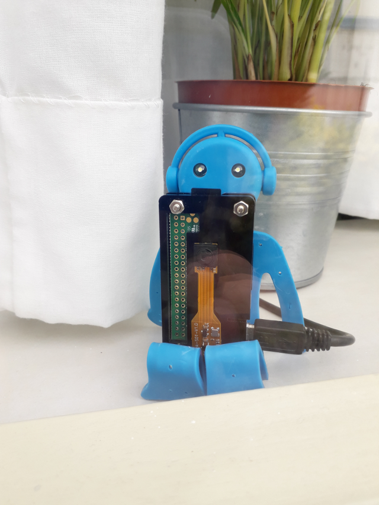
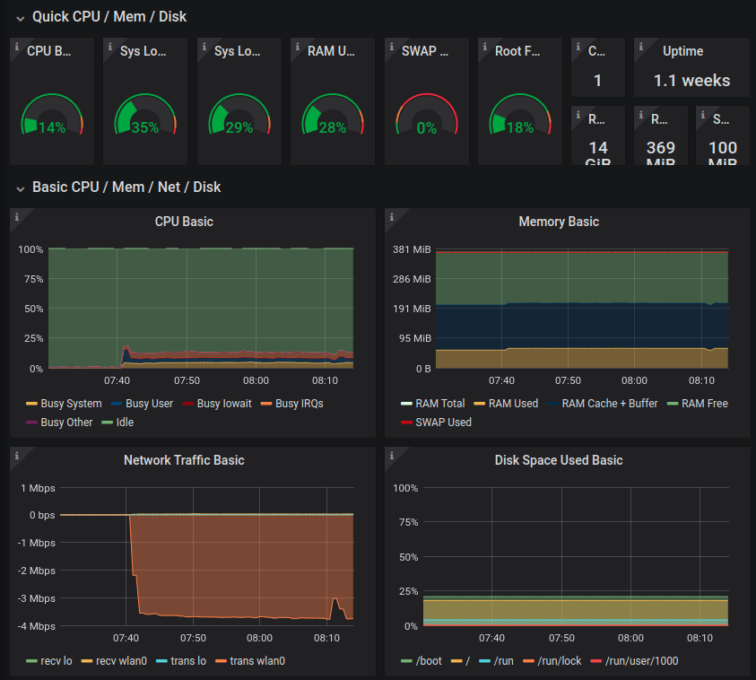

# my_surveillance

Let's create a monitoring system using a raspberry pi zero and other pc. What made me start this project? I live in an industrial area and trucks come and go a lot in daytime and I wondered how many trucks come to the front of our house. I have a raspberry pi zero with a camera so I thought it would be interesting to do some hobby project with computer vision.




## Structure
Since raspberry pi zero's resource is limited, 1 cpu and 512 MB memory, it only streams live video to another PC and all the processing will be performed on that PC. This PC is the only receiver so that in the streaming communication, raspberry pi zero is the client and the PC is the server.


### Client side code
There is a receipe for streaming over network in the official pycamera package documentation.
https://picamera.readthedocs.io/en/release-1.13/recipes1.html#capturing-to-a-network-stream

The code for client is exactly same as in the link. You just need to install `picamera` package and simply run the code.



It uses about 20 % cpu and no significant amount of memory. It's clear that not too much work for raspberry pi zero.


### Server side code
The server side code is also from the receipe but since I would like to do some processing with `opencv`, the image opened by `PIL` is converted to the format for opencv.

```
from PIL import Image
import cv2

image = Image.open(image_stream)
opencv_image = cv2.cvtColor(np.array(image), cv2.COLOR_RGB2BGR)
```

The rest of the code is pretty much identical in the link.

